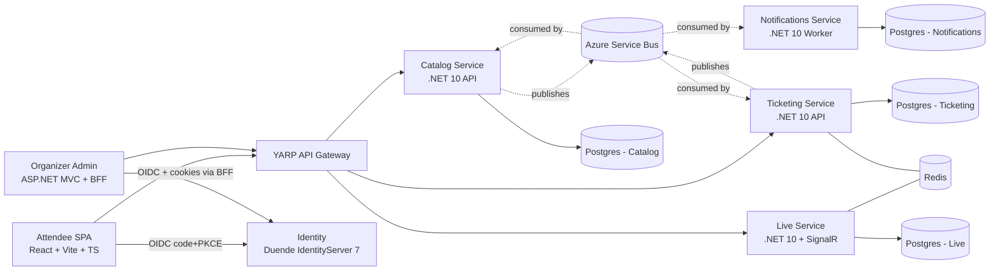

# EventForge — Dedicated Plan

A 10-week, content-driven build of a microservices-based conference & event platform. This document is the source of truth for the project: scope, services, contracts, tech choices, and a week-by-week schedule that names actual deliverables and content angles.

---

## 1. Product Vision

**EventForge** is a platform for running tech conferences and meetups end-to-end. Three audiences interact with it:

- **Organizers** create and manage events, sessions, and ticket inventory; moderate during the event; review analytics afterward. They live in the **MVC admin app**.
- **Attendees** browse events, buy tickets, build a personal agenda, and participate in live Q&A and polls during talks. They live in the **React SPA**.
- **Speakers** see their session schedule and incoming Q&A. They share the React SPA with attendees, gated by a different role.

The product scope is intentionally narrow but architecturally rich. The goal is not to ship a Ticketmaster competitor; it is to traverse — in a real working system — every major topic in *Designing Data-Intensive Applications* with concrete code, real failure modes, and real concurrency.

### MVP Feature Set (the 10-week target)

1. Event creation, editing, publication (organizer)
2. Session catalog: speakers, time slots, rooms, capacity (organizer)
3. Public event browsing and session listings (attendee)
4. Ticket types per event with limited inventory and a sale window
5. Cart → reservation (15-minute hold) → payment → confirmation flow
6. Issued tickets with QR codes (mocked payment provider)
7. Personal agenda: attendees enroll in sessions, capacity-bounded
8. Live Q&A during sessions: post questions, upvote, speaker/moderator mark answered
9. Live polls and a real-time attendance counter
10. Email notifications (confirmations, session-starting reminders)
11. Organizer analytics dashboard: tickets sold, revenue, attendance, popular sessions

Anything beyond this list is post-Week 10 territory. We'll keep that backlog at the end of this document.

---

## 2. Personas & Why Two Frontends

The two-frontend split is *justified by the product*, not by a tutorial wishlist:

| Surface | Tech | Why this is the right tool |
|---|---|---|
| Attendee app (browse, buy, agenda, live Q&A) | React SPA | Mobile-friendly, real-time interactions during talks, snappy navigation, offline-tolerant ticket display |
| Organizer admin (CRUD, dashboards, moderation) | ASP.NET Core MVC + BFF | Form-heavy, server-rendered tables, fewer real-time needs, antiforgery + cookies are easier than juggling SPA token rotation |

This is the same answer real engineering teams give and gives you something genuinely true to argue about in your "SPA vs MVC in 2026" video.

---

## 3. Service Architecture

Five core services plus the IdP. Six bounded contexts total. Each service owns its database — no shared schema.

### 3.1 Container Diagram (C4 Level 2)



### 3.2 Services & Responsibilities

**Identity (Duende IdentityServer 7)**
Issues tokens, manages users, holds role claims (`attendee`, `speaker`, `organizer`, `admin`). Three registered clients: `eventforge.spa`, `eventforge.admin`, `eventforge.gateway`. Scopes: `catalog.read`, `catalog.write`, `ticketing.read`, `ticketing.write`, `live.write`, `admin.full`.

**Catalog**
Owns events, sessions, speakers, venues. The marketing surface of the platform. Read-heavy; aggressive caching. Publishes `EventPublished`, `SessionAdded`, `SessionUpdated`.

**Ticketing**
Owns ticket types, reservations, orders, issued tickets. The transactional heart of the system and where the *interesting* concurrency lives. Calls a mocked payment provider. Publishes `TicketReserved`, `OrderPlaced`, `PaymentSucceeded`, `PaymentFailed`, `TicketIssued`, `ReservationExpired`.

**Live**
Owns Q&A questions, upvotes, polls, votes, and real-time presence per session. SignalR hub with Redis backplane for horizontal scale. Persists questions/polls in Postgres; presence is Redis-only (transient).

**Notifications**
Worker service. Consumes events from the bus and dispatches email (mock SMTP locally, SendGrid/Azure Comm Services in cloud) and in-app notifications. Idempotent by `(EventId, UserId, TemplateKey)` composite key.

**Optional Analytics (post-Week 10)**
CQRS read-side that subscribes to all domain events and builds materialized views for the organizer dashboard. In Week 10 we'll cheat slightly and serve analytics from query-side projections in the existing services.

### 3.3 Data Model — Key Aggregates

**Catalog**
```
Event       { Id, Slug, Name, StartsAt, EndsAt, Venue, Description, Status, OrganizerId, Version }
Session     { Id, EventId, Title, SpeakerIds[], StartsAt, EndsAt, Room, Capacity, Tags[] }
Speaker     { Id, Name, Bio, PhotoUrl, SocialLinks[] }
```

**Ticketing**
```
TicketType  { Id, EventId, Name, Price, TotalInventory, SoldCount, SaleStart, SaleEnd, RowVersion }
Reservation { Id, TicketTypeId, Quantity, UserId, ExpiresAt, Status }   -- TTL via Redis
Order       { Id, UserId, Items[], Total, Status, PaymentRef, CreatedAt, IdempotencyKey }
IssuedTicket{ Id, OrderId, TicketTypeId, AttendeeUserId, QRCode, Status }
OutboxItem  { Id, Type, Payload, OccurredAt, ProcessedAt }
```

**Live**
```
Question      { Id, SessionId, AskedByUserId, Body, Status, AskedAt }
QuestionVote  { QuestionId, UserId }   -- composite PK enforces idempotency
Poll          { Id, SessionId, Prompt, Options[], Status }
PollVote      { PollId, UserId, OptionId }   -- composite PK
```

**Notifications**
```
NotificationLog { Id, UserId, Channel, TemplateKey, CorrelationId, Status, Attempts, ProcessedAt }
```

### 3.4 Domain Events on the Bus

| Event | Producer | Consumers |
|---|---|---|
| `EventPublished` | Catalog | Notifications (announce to interested users), Analytics |
| `SessionAdded` / `SessionUpdated` | Catalog | Notifications (notify enrolled), Ticketing (sync session capacity) |
| `TicketReserved` | Ticketing | (none yet — for analytics later) |
| `ReservationExpired` | Ticketing | Ticketing self-handler that releases inventory |
| `OrderPlaced` | Ticketing | Notifications (order received), Analytics |
| `PaymentSucceeded` | Ticketing | Ticketing (issue tickets), Notifications (receipt) |
| `PaymentFailed` | Ticketing | Notifications (failure email), Ticketing (release reservation) |
| `TicketIssued` | Ticketing | Notifications (e-ticket with QR), Analytics |

### 3.5 The Centerpiece: Ticket Reservation Concurrency

This single feature is the spine of weeks 6–7 and at least three pieces of content. Here's the sequence:

```mermaid
sequenceDiagram
    participant U as User (SPA)
    participant T as Ticketing API
    participant DB as Postgres (Ticketing)
    participant R as Redis
    participant Pay as Payment (mock)
    participant Bus as Service Bus

    U->>T: POST /reservations { ticketTypeId, qty }
    T->>DB: SELECT TicketType FOR UPDATE / RowVersion read
    T->>DB: UPDATE SoldCount += qty (optimistic concurrency)
    alt Conflict
        T-->>U: 409 with retry hint
    else Success
        T->>R: SET reservation:{id} TTL=15m
        T->>DB: INSERT Reservation (Pending)
        T-->>U: 201 reservationId, expiresAt
    end

    U->>T: POST /orders { reservationId, paymentToken, idempotencyKey }
    T->>Pay: Charge
    alt Payment OK
        Pay-->>T: success
        T->>DB: INSERT Order (Confirmed) + IssuedTickets (TX)
        T->>DB: INSERT OutboxItem (PaymentSucceeded, TicketIssued)
        Note over Bus: Outbox publisher relays to Service Bus
    else Payment fails
        Pay-->>T: failure
        T->>DB: Order=Failed; release inventory; mark Reservation Cancelled
        T->>DB: INSERT OutboxItem (PaymentFailed)
    end
```

What makes this rich for content: every line in that diagram has a tradeoff worth a paragraph. Optimistic vs pessimistic concurrency. Idempotency keys on `POST /orders`. Outbox vs direct publish. Whether to use a saga state machine or simple event handlers. What "exactly-once" really means.

---

## 4. Technology Choices

| Layer | Choice | Why |
|---|---|---|
| Backend | .NET 10 (current LTS) | Stack constraint; current LTS as of mid-2026 |
| API style | REST + JSON | Pragmatic; OpenAPI for free; GraphQL not justified by the use case |
| ORM | EF Core 10 with Postgres | Excellent migrations + RowVersion support |
| Database | Postgres (one per service) | One technology, predictable behavior, free locally and on Azure |
| Cache & SignalR backplane | Redis | Standard choice; doubles for reservation TTLs |
| Messaging | MassTransit over Azure Service Bus (RabbitMQ for local dev) | First-class outbox, sagas, retry/redelivery |
| Identity | Duende IdentityServer 7 | Required by the brief and what the channel teaches |
| API gateway | YARP | Microsoft-native, lightweight, sensible defaults |
| BFF | `Duende.BFF` package | Solves the SPA token-handling problem cleanly |
| Frontend (attendee) | React 18 + Vite + TypeScript + TanStack Query + `oidc-client-ts` | Standard modern stack |
| Frontend (admin) | ASP.NET Core MVC | Stack constraint; honest fit for forms+tables |
| Resilience | Polly | Retries, circuit breakers, bulkheads |
| Observability | OpenTelemetry → Application Insights (cloud) / Aspire dashboard (local) | Vendor-neutral instrumentation, Microsoft-native sink |
| Testing | xUnit + FluentAssertions + Testcontainers + WebApplicationFactory | Real Postgres in tests; no in-memory cheats |
| Load testing | k6 (also acceptable: NBomber) | Scriptable, scriptable, free |
| IaC | Bicep | Native Azure, less ceremony than Terraform for an Azure-only target |
| Hosting | Azure Container Apps | Right-sized for this scope; serverless scaling; far cheaper than AKS for a portfolio project |
| CI/CD | GitHub Actions | Public repo, native to GitHub, free for open source |
| Container registry | Azure Container Registry | Tight integration with Container Apps |
| Secrets | Azure Key Vault | Referenced by Container Apps environment variables |

### Repo Structure

```
eventforge/
├── docs/
│   ├── architecture/          # C4 diagrams, sequence diagrams, ADRs
│   ├── adr/                   # 0001-language-and-framework.md, ...
│   └── content/               # Scripts and outlines for each YouTube episode
├── services/
│   ├── identity/              # Duende IdentityServer
│   ├── catalog/
│   ├── ticketing/
│   ├── live/
│   └── notifications/
├── shared/
│   ├── EventForge.Contracts/  # Event schemas published on the bus
│   └── EventForge.Building/   # Shared infrastructure (logging, OTel setup)
├── clients/
│   ├── attendee-spa/          # React + Vite
│   └── organizer-admin/       # ASP.NET Core MVC
├── gateway/                   # YARP
├── infra/
│   ├── bicep/                 # Modules + main
│   └── compose/               # docker-compose for local dev
├── tests/
│   └── load/                  # k6 scripts
├── .github/workflows/         # build.yml, deploy.yml, preview.yml
└── README.md                  # Updated weekly with progress + links
```

---

## 5. Architecture Decisions Worth Highlighting

These are the "money shots" — moments where you can pause, draw on the whiteboard, and explain a real tradeoff with code on screen. Each one is at least one short-form post and many are long-form videos.

1. **Database per service vs shared.** Concrete: Catalog and Ticketing use separate Postgres DBs. Concrete: how do you query "events I have tickets for"? Cross-service join is forbidden — you compose at the API gateway or push a denormalized read model.
2. **Optimistic concurrency on `TicketType.SoldCount`.** Demo the race condition under load with k6, then fix it.
3. **Outbox pattern.** Show the dual-write problem first (publish + DB commit fails), then the outbox solution.
4. **Reservation TTL in Redis vs Postgres job.** Walk the tradeoff. Redis is simpler; Postgres job is more durable.
5. **BFF pattern for the MVC admin.** Why not just store the access token in localStorage and call APIs from JS? Walk through the threat model.
6. **SignalR with Redis backplane.** Why backplane is needed when Container Apps scales to multiple replicas.
7. **Idempotency keys on `POST /orders`.** Prevent double charges from retried HTTP requests.
8. **Per-PR preview environments.** If you stretch to this in Week 9, it's a flex.

---

## 6. Demo Data Plan

For demos and load tests to feel real, seed:

- 3 conferences (1 ended, 1 active, 1 upcoming with hot ticket sales)
- ~30 sessions per conference, 8 speakers each
- 4 ticket types per active conference (Early Bird sold out, General almost sold out, VIP available, Workshop with capacity 20)
- ~500 attendee accounts spread across realistic personas

Bake the seed scripts into `services/*/Migrations/Seed/` so Docker Compose is one command to a populated demo.

---

## 7. The Week-by-Week Schedule

Each week below names files, endpoints, and content angles specific to EventForge.

### Week 1 — Foundations & Architecture

**Read.** DDIA Ch 1–2.
**Watch.** Hello Interview — system-design framework, requirements gathering.

**Build.**
- `docs/architecture/c4-context.png` and `c4-container.png`
- `docs/adr/` — write five ADRs (language/framework, communication style, db-per-service, hosting target, auth)
- `docs/personas.md` and `docs/glossary.md` (Event, Session, Reservation, Order, IssuedTicket, …)
- Initial repo skeleton with empty service folders, each containing a placeholder `Program.cs` returning `"hello from <service>"`
- `infra/compose/docker-compose.yml` brings up all stub services + Postgres + Redis + RabbitMQ
- README v0.1 with the diagram and a roadmap

**Content.**
- **YouTube** *Episode 0 — Designing EventForge from scratch: requirements to architecture* (whiteboard the C4 model, walk each ADR, justify each choice)
- **LinkedIn** announcement post — the project, the goal, public repo, weekly cadence
- **Blog** *The 5 ADRs I write before a single line of code*

### Week 2 — Identity & Authentication

**Read.** DDIA Ch 3 (skim B-tree internals; focus on indexing semantics).
**Watch.** Duende channel — IdentityServer 7 setup, OAuth2/OIDC flows, scopes, claims.

**Build.**
- `services/identity` with Duende IdentityServer 7
- EF Core stores for clients, scopes, persisted grants
- Three clients registered (`eventforge.spa`, `eventforge.admin`, `eventforge.gateway`)
- Scopes: `catalog.read`, `catalog.write`, `ticketing.read`, `ticketing.write`, `live.write`, `admin.full`
- Role claims; seed two organizers, one speaker, ten attendees
- Login/consent UI styled to match (don't ship Duende's default look)
- Postman collection committed: `docs/api/identity.postman.json`

**Content.**
- **YouTube** *OAuth2 and OIDC explained by actually implementing them in EventForge*
- **LinkedIn** *JWT vs cookies — and why I'm using BOTH in the same system*
- Repo tag `v0.2.0-identity`

### Week 3 — Catalog Service

**Read.** DDIA Ch 4 (Encoding & Evolution).
**Watch.** Milan Jovanović — Clean Architecture, MediatR/CQRS, DDD tactical patterns.

**Build.**
- `services/catalog` with Clean Architecture layers (`Domain`, `Application`, `Infrastructure`, `Api`)
- Aggregates: `Event` (root), `Session`, `Speaker`
- EF Core migrations, Postgres
- Endpoints: `GET /events`, `GET /events/{slug}`, `POST /events`, `PUT /events/{id}`, `POST /events/{id}/sessions`, `GET /events/{id}/sessions`
- OpenAPI/Swagger
- FluentValidation
- Integration tests with `WebApplicationFactory` + Testcontainers Postgres
- Domain events fired internally (not yet on the bus)

**Content.**
- **YouTube** *Building a microservice with DDD — without it feeling like overkill*
- **Blog** *Aggregates the way I actually use them*
- **LinkedIn** Testcontainers tip with code snippet

### Week 4 — Attendee SPA

**Read.** Finish DDIA Ch 4; skim Ch 5 intro.
**Watch.** Hello Interview — API design, pagination patterns, error-handling conventions.

**Build.**
- `clients/attendee-spa` (Vite + React + TS)
- `oidc-client-ts` integration; silent renew
- Pages: `Login`, `EventList`, `EventDetail`, `SessionList`
- TanStack Query with auth-aware fetcher
- Calls Catalog through the YARP gateway (introduce gateway minimally this week)
- Local dev wired into compose

**Content.**
- **YouTube** *Authenticating a React SPA against IdentityServer — every step that matters in 2026*
- **Blog** *TanStack Query patterns when your tokens can expire mid-flight*
- **LinkedIn** comparison post: `oidc-client-ts` vs alternatives

### Week 5 — Organizer Admin (MVC + BFF)

**Read.** DDIA Ch 5 first half (single-leader replication).
**Watch.** Duende — `Duende.BFF`, YARP integration patterns.

**Build.**
- `clients/organizer-admin` (ASP.NET Core MVC)
- `Duende.BFF` for cookie-based session + automatic token refresh
- Pages: Dashboard, Events list, Create/Edit Event, Sessions list, Add Session
- TagHelpers, antiforgery, server-side validation mirroring FluentValidation rules
- Authorization policies tied to `organizer` and `admin` role claims

**Content.**
- **YouTube** *SPA vs MVC in 2026 — same backend, two frontends, real comparison* (this one will perform; controversy bait grounded in code)
- **LinkedIn** thread *5 reasons MVC is still the right call for admin UIs*
- **Blog** *The BFF pattern explained with EventForge* (with sequence diagram)

### Week 6 — Ticketing Service & The Concurrency Story

**Read.** Finish DDIA Ch 5; Ch 6 (Partitioning).
**Watch.** Ben Dicken — DB internals, indexes, locking, isolation levels.

**Build.**
- `services/ticketing` with its own Postgres database
- Aggregates: `TicketType`, `Reservation`, `Order`, `IssuedTicket`
- Endpoints: `POST /reservations`, `GET /reservations/{id}`, `POST /orders`, `GET /orders/{id}`, `GET /tickets/{id}`
- `RowVersion` on `TicketType`, optimistic concurrency with retry helper
- Reservation TTL in Redis (`reservation:{id}` with 15-minute expiry), background sweeper that handles expiry events
- Mock payment endpoint (`POST /mock-payments/charge`) — fails on amount ending in `.13` for chaos demos
- `tests/load/reservation-burst.js` k6 script — 200 concurrent buyers, 50 tickets available; demonstrate the race, then the fix

**Content.**
- **YouTube** *Why your ticketing system has a race condition — and the three ways to fix it* — pin this. This is the episode that should land you on Hello Interview's radar.
- **Blog** *Optimistic vs pessimistic vs distributed locks — choosing for ticket inventory*
- **LinkedIn** k6 results screenshot before/after with one-paragraph explanation

### Week 7 — Async Communication, Outbox, Saga

**Read.** DDIA Ch 7–8 (Transactions; Trouble with Distributed Systems). Take your time.
**Watch.** Milan Jovanović — outbox pattern, MassTransit, saga state machines, idempotency.

**Build.**
- MassTransit configured in all services
- Azure Service Bus emulator locally; real Service Bus in cloud
- Outbox table + relay in Catalog and Ticketing
- Events from §3.4 published end-to-end
- `services/notifications` worker consuming `OrderPlaced`, `PaymentSucceeded`, `PaymentFailed`, `TicketIssued`
- Local "email" output goes to a captured maildir; cloud uses Azure Communication Services
- Idempotency keys on `POST /orders`; consumer-side dedupe in Notifications
- Saga state machine for the reservation → payment → confirmation flow

**Content.**
- **YouTube** *The outbox pattern in EventForge — preventing dual-writes, in production code*
- **Blog** *Sagas vs choreography — and why I went with a state machine here*
- **LinkedIn** outbox diagram + 1-paragraph explainer

### Week 8 — Live Service, Observability, Chaos

**Read.** DDIA Ch 9 (Consistency & Consensus) — focus on practical implications.
**Watch.** Hello Interview / Milan — observability, OpenTelemetry, Polly, resilience patterns.

**Build.**
- `services/live` with SignalR hub + Redis backplane
- Endpoints/methods: `AskQuestion`, `UpvoteQuestion`, `MarkAnswered`, `JoinSession`, `LeaveSession`, `BroadcastPoll`
- React SPA wires up the live experience using `@microsoft/signalr`
- OpenTelemetry across **every** service (traces + metrics + logs); exporter to .NET Aspire dashboard locally and Application Insights in cloud
- Polly retry + circuit-breaker policies on outbound HTTP and bus consumers
- Health-check endpoints (`/health/live`, `/health/ready`)
- **Chaos demo:** kill the Notifications worker mid-saga, screen-record what the trace timeline shows; then kill Ticketing during a reservation burst

**Content.**
- **YouTube** *I broke EventForge on purpose — what the traces showed* (visually compelling, very shareable)
- **Blog** *OpenTelemetry in a real .NET microservices system — the parts that actually matter*
- **LinkedIn** annotated trace screenshot

### Week 9 — Azure Deployment + CI/CD

**Read.** DDIA Ch 10 (Batch Processing) — light read.
**Watch.** Microsoft Learn / Azure Friday — Container Apps, Bicep, GitHub Actions.

**Build.**
- `infra/bicep/` modules: `containerAppsEnv.bicep`, `postgres.bicep`, `redis.bicep`, `serviceBus.bicep`, `keyVault.bicep`, `appInsights.bicep`, `acr.bicep`; `main.bicep` composes them
- Per-service multi-stage Dockerfiles
- `.github/workflows/build.yml`: build, test, Trivy scan
- `.github/workflows/deploy.yml`: push images to ACR, run `az deployment group create`, smoke-test the deployed environment
- Secrets in Key Vault, referenced via Container Apps secret refs
- Custom domain + managed cert
- (Stretch) per-PR preview environments via a third workflow
- First green production deploy; live link in the README

**Content.**
- **YouTube** *Deploying EventForge to Azure — every Bicep file, every workflow step* — long-form, evergreen, will keep earning views for years
- **Blog** *What it costs to run EventForge on Azure — itemized*
- **LinkedIn** live link to the deployed app, "find a bug, get credit in the next video"

### Week 10 — Streaming, Performance, Capstone

**Read.** DDIA Ch 11–12 (Stream Processing; Future of Data Systems).
**Watch.** Loop back to Ben Dicken on perf/database topics.

**Build.**
- Real-time per-session attendance counter (live stream of presence-join/leave events into the SignalR hub)
- `tests/load/full-flow.js` k6 against the deployed environment: browse → reserve → purchase → live participation
- Profile the slowest endpoint, fix it on camera, document what changed
- `README.md` v1.0: full architecture diagram, link to every episode, link to every blog post, run-it-yourself instructions
- Tag `v1.0.0` and write release notes
- 5-minute demo video for the README hero

**Content.**
- **YouTube** capstone — *EventForge — 10 weeks, 5 services, full source, full debrief*. Pin this on the channel.
- **Blog** post-mortem with real numbers: commits, hours spent, what worked, what flopped, what I'd do differently. This format performs unusually well.
- **LinkedIn** retrospective with the demo video embedded; tag the channels you learned from.

---

## 8. Backlog (Beyond Week 10)

Stretch goals you can keep building toward content for, after the capstone:

- **Analytics service** with dedicated CQRS read store (e.g., projections into a denormalized Postgres or DuckDB) — covers DDIA's derived-data chapter properly
- **Multi-region active-passive** deployment with Geo-replicated Postgres — replication chapter brought to life
- **AI features**: session recommendation based on attendee history; auto-tagging of submitted talks
- **Mobile companion** in React Native sharing OIDC client and API contracts
- **Speaker submission & review workflow** (CFP)
- **Refunds and partial refunds** — interesting state machine extension to the order saga
- **Open OpenAPI + generated TS clients** — reduces drift between SPA and API

---

## 9. Operating Cadence (the daily-life version)

Treat this like the meta-process around the schedule above:

- **Monday.** Plan the week. Write that week's content angles into `docs/content/week-N.md` before you write code. The content angle informs *what* to build first.
- **Tue–Thu.** Build, with screen recording on whenever you're solving an interesting problem.
- **Friday.** Edit and ship the week's main content. Push code; tag the release.
- **Saturday.** DDIA reading + watching, take notes that reference the week's commits.
- **Sunday.** Two short-form posts queued for the coming week. Rest.

The single rule that makes this work: **content is grounded in commits**. If you wrote it, you can talk about it. If you only read about it, you can't — yet.
